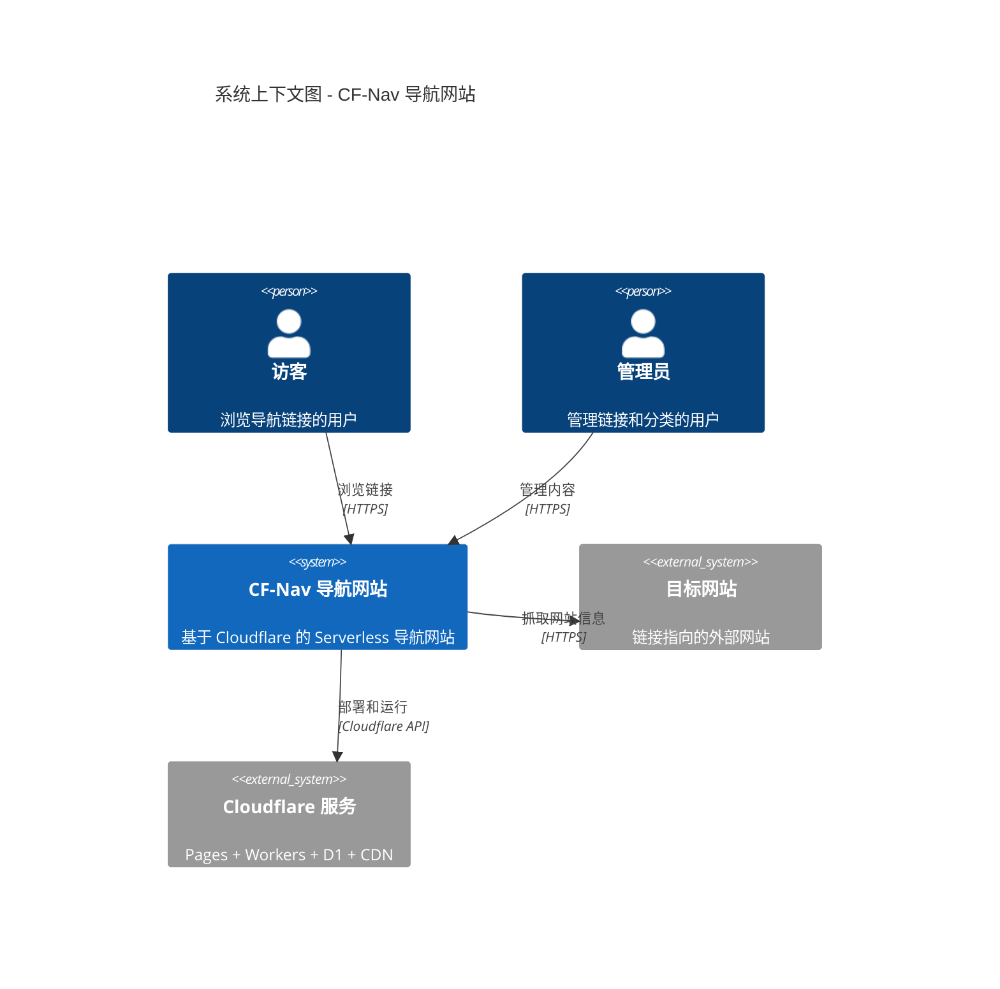
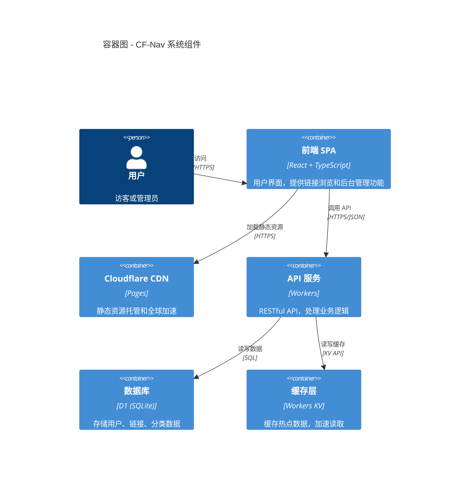
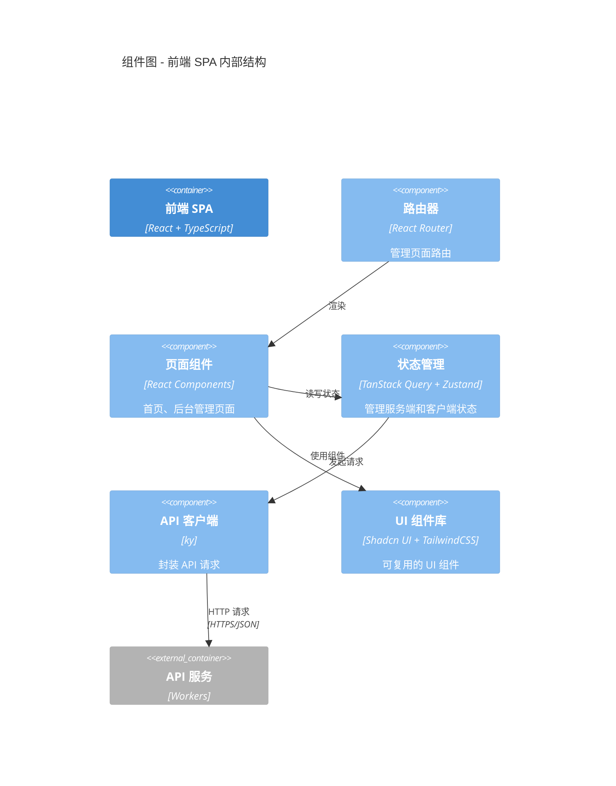
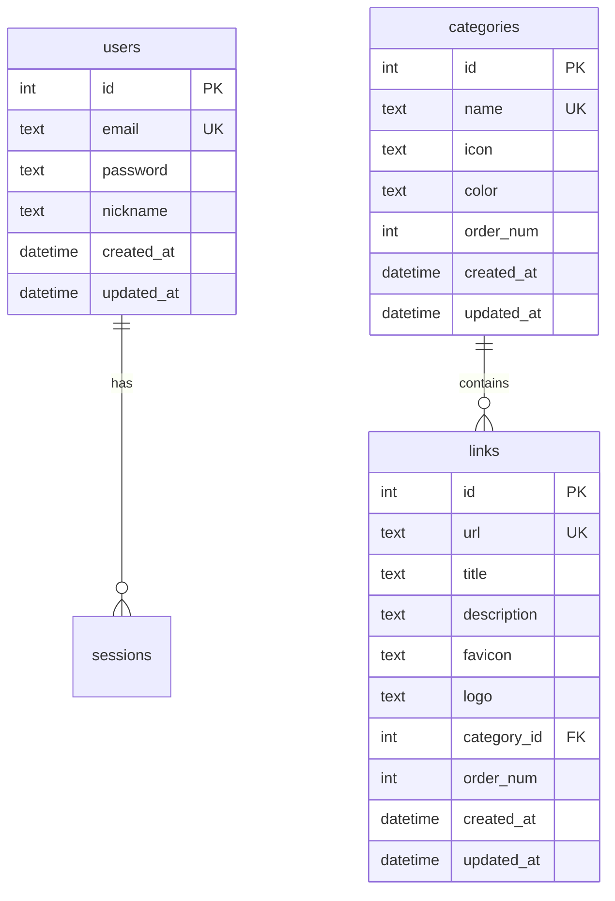
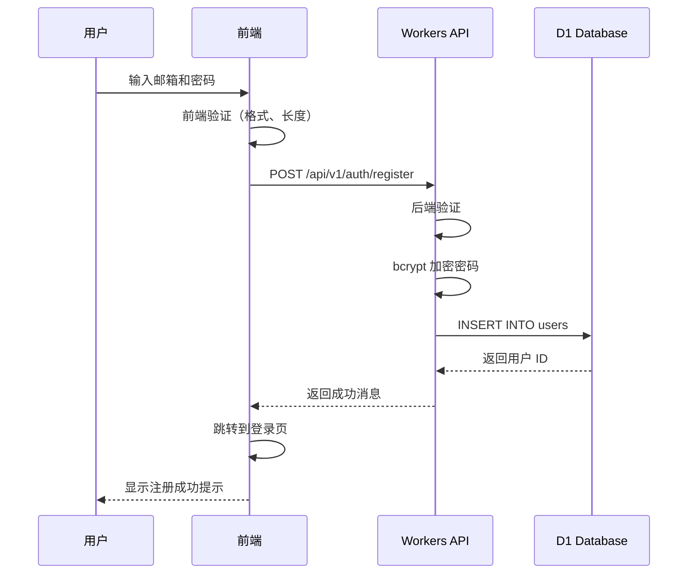
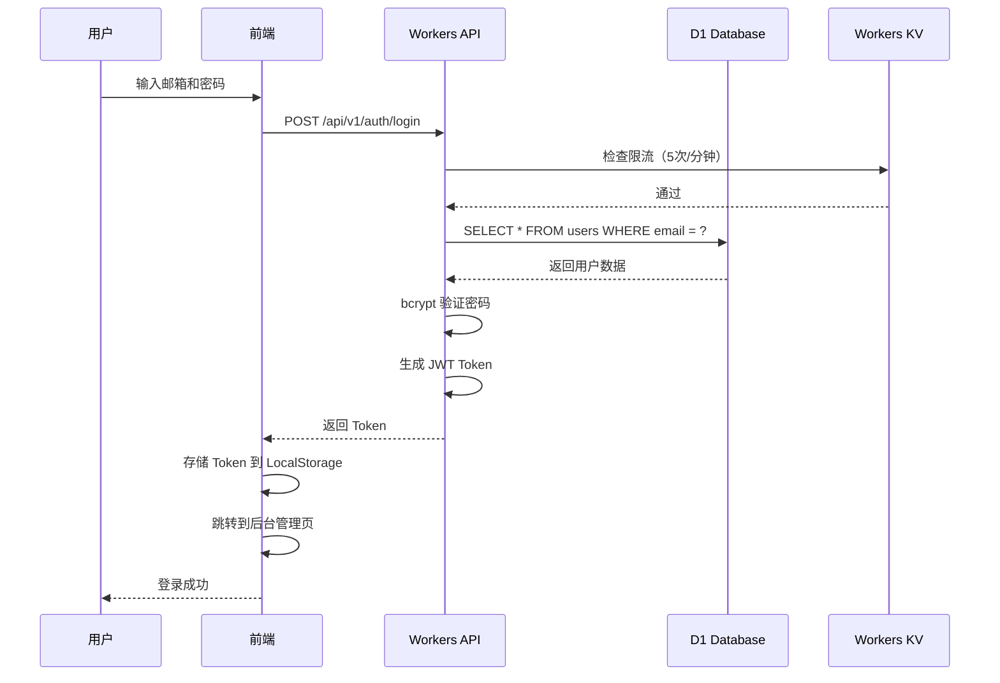
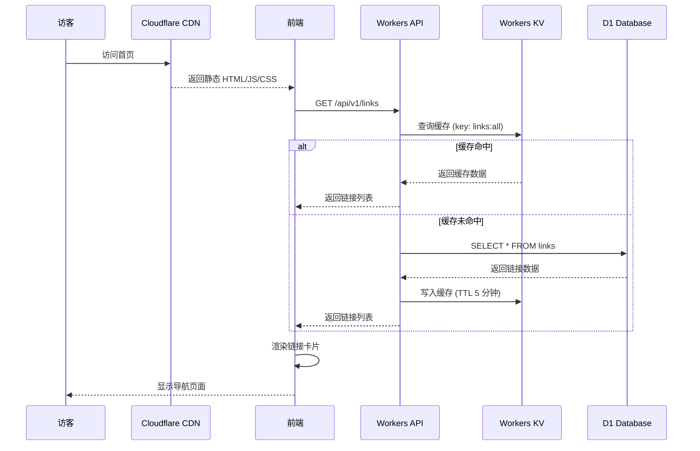
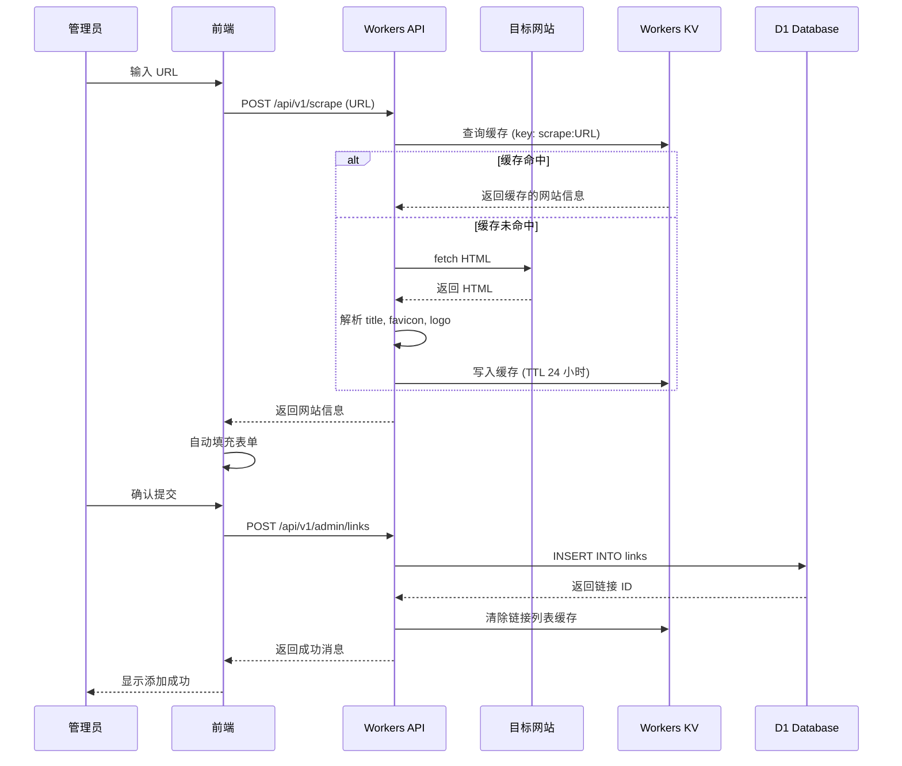
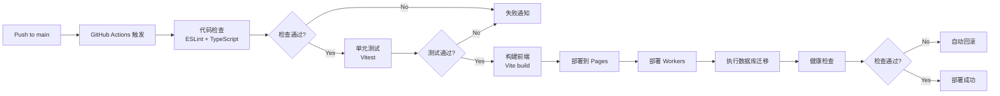

# Cloudflare 导航网站 - 系统架构设计

## 📋 执行摘要

**项目名称**: CF-Nav (Cloudflare Navigation)
**架构类型**: Serverless JAMstack Architecture
**核心技术栈**: React + Cloudflare Pages + Workers + D1
**架构原则**: SOLID, KISS, DRY, YAGNI
**目标性能**: 首页加载 < 2s, API 响应 < 500ms, 可用性 99.9%

本架构设计基于 Cloudflare 免费套餐，采用前后端分离的现代化架构，通过 CDN 加速、KV 缓存、数据库索引优化等手段确保高性能和低成本。

---

## 🏗️ 架构概览

### 系统上下文图 (C4 Model - Level 1)



### 容器图 (C4 Model - Level 2)



### 组件图 (C4 Model - Level 3)



---

## 🎨 技术栈决策

### 前端技术栈

| 技术类别 | 选择方案 | 版本 | 选择理由 |
|---------|---------|------|---------|
| **框架** | React | 18.2+ | 生态系统成熟，组件库丰富，团队熟悉度高 |
| **语言** | TypeScript | 5.3+ | 类型安全，减少运行时错误，提升开发体验 |
| **构建工具** | Vite | 5.0+ | 构建速度快，开发体验好，满足 Pages 20 分钟限制 |
| **UI 框架** | Tailwind CSS | 3.4+ | 原子化 CSS，灵活性高，打包体积小 |
| **组件库** | Shadcn UI | Latest | 无样式组件，可定制性强，TypeScript 友好 |
| **路由** | React Router | 6.20+ | 标准的 React 路由解决方案，支持嵌套路由 |
| **状态管理 (服务端)** | TanStack Query | 5.0+ | 专注服务端状态，自动缓存、重试、同步 |
| **状态管理 (客户端)** | Zustand | 4.4+ | 轻量级 (< 1KB)，API 简洁，TypeScript 支持好 |
| **HTTP 客户端** | ky | 1.1+ | 轻量级，基于 fetch，错误处理优雅 |
| **表单管理** | React Hook Form | 7.48+ | 性能优秀，API 简洁，支持 validation |
| **图标** | Lucide Icons | Latest | 轻量级，样式一致，Tree-shaking 友好 |
| **日期处理** | date-fns | 3.0+ | 模块化，Tree-shaking 友好，轻量级 |

### 后端技术栈

| 技术类别 | 选择方案 | 版本 | 选择理由 |
|---------|---------|------|---------|
| **运行时** | Cloudflare Workers | Latest | 全球边缘计算，冷启动快，成本低 |
| **框架** | Hono | 3.11+ | 轻量级 (< 20KB)，性能优秀，专为 Workers 优化 |
| **数据库** | Cloudflare D1 | Latest | SQLite 兼容，免费套餐 5GB，适合读多写少 |
| **缓存** | Workers KV | Latest | 全球分布式，读取速度快 (< 10ms) |
| **ORM** | Drizzle ORM | 0.29+ | 轻量级，TypeScript 友好，支持 D1 |
| **密码加密** | bcryptjs | 2.4+ | 纯 JS 实现，适合 Workers，安全性高 |
| **JWT** | @tsndr/cloudflare-worker-jwt | Latest | 专为 Workers 优化，性能好 |
| **HTML 解析** | linkedom | 0.16+ | 轻量级 DOM 实现，用于网站信息抓取 |
| **验证** | Zod | 3.22+ | TypeScript 优先，类型推导强大 |

### DevOps 技术栈

| 技术类别 | 选择方案 | 版本 | 选择理由 |
|---------|---------|------|---------|
| **部署工具** | Wrangler CLI | 3.0+ | Cloudflare 官方工具，功能完善 |
| **CI/CD** | GitHub Actions | - | 与 GitHub 深度集成，配置简单 |
| **代码检查** | ESLint | 8.54+ | 标准的 JavaScript/TypeScript 检查工具 |
| **代码格式化** | Prettier | 3.1+ | 统一代码风格，减少代码审查时间 |
| **测试框架** | Vitest | 1.0+ | Vite 原生支持，速度快，API 兼容 Jest |
| **E2E 测试** | Playwright | 1.40+ | 跨浏览器测试，API 稳定 |
| **监控** | Cloudflare Analytics | - | 免费，与 Workers 深度集成 |

---

## 🔧 组件设计

### 1. 前端组件架构

#### 目录结构
```
src/
├── pages/              # 页面组件
│   ├── Home.tsx       # 首页（链接展示）
│   ├── Admin/         # 后台管理
│   │   ├── Dashboard.tsx
│   │   ├── Links.tsx
│   │   ├── Categories.tsx
│   │   └── Settings.tsx
│   └── Auth/          # 认证页面
│       ├── Login.tsx
│       └── Register.tsx
├── components/         # 可复用组件
│   ├── ui/            # UI 基础组件（Shadcn UI）
│   ├── LinkCard.tsx   # 链接卡片
│   ├── CategoryNav.tsx # 分类导航
│   └── SearchBar.tsx  # 搜索框
├── hooks/             # 自定义 Hooks
│   ├── useAuth.ts     # 认证逻辑
│   ├── useLinks.ts    # 链接管理
│   └── useCategories.ts # 分类管理
├── lib/               # 工具库
│   ├── api.ts         # API 客户端
│   ├── auth.ts        # 认证工具
│   └── utils.ts       # 通用工具
├── stores/            # Zustand 状态
│   ├── theme.ts       # 主题状态
│   └── search.ts      # 搜索状态
└── types/             # TypeScript 类型定义
    └── index.ts
```

#### 核心组件说明

**1. LinkCard 组件**
- **目的**: 展示单个链接的卡片
- **技术**: React + Tailwind CSS
- **接口**:
  - 输入: `{ id, url, title, description, favicon, logo }`
  - 输出: 可点击的卡片，点击在新标签页打开链接
- **依赖关系**: 无外部依赖，纯展示组件

**2. CategoryNav 组件**
- **目的**: 分类导航栏
- **技术**: React + React Router
- **接口**:
  - 输入: `categories[]`, `activeCategory`
  - 输出: 分类标签列表，点击切换分类
- **依赖关系**: 依赖 `useCategories` Hook

**3. SearchBar 组件**
- **目的**: 搜索链接
- **技术**: React + Zustand
- **接口**:
  - 输入: `placeholder`
  - 输出: 搜索关键词变化事件
- **依赖关系**: 依赖 `searchStore`

### 2. 后端组件架构

#### Workers 目录结构
```
workers/
├── src/
│   ├── index.ts           # Workers 入口
│   ├── router.ts          # 路由定义
│   ├── middlewares/       # 中间件
│   │   ├── auth.ts        # JWT 认证
│   │   ├── rateLimit.ts   # 限流
│   │   └── cors.ts        # CORS 处理
│   ├── handlers/          # API 处理器
│   │   ├── auth.ts        # 认证 API
│   │   ├── links.ts       # 链接 API
│   │   ├── categories.ts  # 分类 API
│   │   └── scrape.ts      # 网站信息抓取
│   ├── services/          # 业务逻辑
│   │   ├── authService.ts
│   │   ├── linkService.ts
│   │   └── scrapeService.ts
│   ├── db/                # 数据库
│   │   ├── schema.ts      # Drizzle Schema
│   │   └── queries.ts     # 查询封装
│   └── utils/             # 工具函数
│       ├── jwt.ts
│       ├── bcrypt.ts
│       └── validation.ts
└── migrations/            # 数据库迁移
    ├── 0001_create_users.sql
    ├── 0002_create_categories.sql
    └── 0003_create_links.sql
```

#### 核心组件说明

**1. Router (Hono)**
- **目的**: API 路由管理
- **技术**: Hono Framework
- **路由定义**:
```typescript
const app = new Hono<{ Bindings: Env }>()

// 公开 API
app.get('/api/v1/links', getLinks)
app.get('/api/v1/categories', getCategories)

// 认证 API
app.post('/api/v1/auth/register', register)
app.post('/api/v1/auth/login', login)

// 受保护的 API (需要 JWT)
app.use('/api/v1/admin/*', authMiddleware)
app.post('/api/v1/admin/links', createLink)
app.put('/api/v1/admin/links/:id', updateLink)
app.delete('/api/v1/admin/links/:id', deleteLink)
```

**2. Auth Middleware**
- **目的**: JWT Token 验证
- **技术**: @tsndr/cloudflare-worker-jwt
- **逻辑**:
  1. 从 Authorization Header 提取 Token
  2. 验证 Token 签名和过期时间
  3. 将用户信息注入 Context
  4. 验证失败返回 401

**3. Rate Limit Middleware**
- **目的**: 防止暴力破解和 DDoS
- **技术**: Workers KV
- **逻辑**:
```typescript
async function rateLimit(ip: string, key: string, limit: number): Promise<boolean> {
  const count = await kv.get(`ratelimit:${key}:${ip}`)
  if (count && parseInt(count) >= limit) {
    return false // 超过限制
  }
  await kv.put(`ratelimit:${key}:${ip}`, (parseInt(count || '0') + 1).toString(), {
    expirationTtl: 60, // 1 分钟后过期
  })
  return true
}
```

**4. Scrape Service**
- **目的**: 抓取网站信息（title, favicon, logo）
- **技术**: linkedom (轻量级 DOM 解析)
- **流程**:
  1. fetch 目标网站 HTML
  2. 解析 HTML 提取 `<title>`
  3. 提取 `<link rel="icon">` 或 `<link rel="shortcut icon">`
  4. 提取 `<meta property="og:image">`
  5. 缓存结果到 KV (TTL 24 小时)
- **错误处理**:
  - 超时 (10s) → 返回默认值
  - 无法访问 → 返回错误信息
  - 解析失败 → 返回部分数据

---

## 📊 数据架构

### 数据库 Schema (D1)

#### 1. users 表
```sql
CREATE TABLE users (
    id INTEGER PRIMARY KEY AUTOINCREMENT,
    email TEXT UNIQUE NOT NULL,
    password TEXT NOT NULL, -- bcrypt 加密
    nickname TEXT,
    created_at DATETIME DEFAULT CURRENT_TIMESTAMP,
    updated_at DATETIME DEFAULT CURRENT_TIMESTAMP
);

CREATE INDEX idx_users_email ON users(email);
```

#### 2. categories 表
```sql
CREATE TABLE categories (
    id INTEGER PRIMARY KEY AUTOINCREMENT,
    name TEXT UNIQUE NOT NULL,
    icon TEXT, -- Lucide 图标名称（如 'code', 'book'）
    color TEXT, -- 颜色代码（如 '#3B82F6'）
    order_num INTEGER DEFAULT 0,
    created_at DATETIME DEFAULT CURRENT_TIMESTAMP,
    updated_at DATETIME DEFAULT CURRENT_TIMESTAMP
);

-- 插入默认分类
INSERT INTO categories (id, name, icon, color, order_num)
VALUES (0, '默认分类', 'folder', '#6B7280', 0);

CREATE INDEX idx_categories_order ON categories(order_num);
CREATE UNIQUE INDEX idx_categories_name ON categories(name);
```

#### 3. links 表
```sql
CREATE TABLE links (
    id INTEGER PRIMARY KEY AUTOINCREMENT,
    url TEXT UNIQUE NOT NULL,
    title TEXT NOT NULL,
    description TEXT,
    favicon TEXT, -- favicon URL
    logo TEXT, -- logo URL
    category_id INTEGER NOT NULL DEFAULT 0,
    order_num INTEGER DEFAULT 0, -- 排序字段
    created_at DATETIME DEFAULT CURRENT_TIMESTAMP,
    updated_at DATETIME DEFAULT CURRENT_TIMESTAMP,
    FOREIGN KEY (category_id) REFERENCES categories(id) ON DELETE SET DEFAULT
);

CREATE INDEX idx_links_category_id ON links(category_id);
CREATE INDEX idx_links_order ON links(order_num);
CREATE UNIQUE INDEX idx_links_url ON links(url);
```

### 数据关系图 (ER Diagram)



### 数据流设计

#### 1. 用户注册流程


#### 2. 用户登录流程


#### 3. 首页加载流程（带缓存优化）


#### 4. 添加链接流程（带自动抓取）


---

## 🔒 安全架构

### 1. 认证与授权

#### JWT Token 设计
```json
{
  "header": {
    "alg": "HS256",
    "typ": "JWT"
  },
  "payload": {
    "user_id": 1,
    "email": "admin@example.com",
    "iat": 1704067200,
    "exp": 1704153600
  },
  "signature": "..."
}
```

**安全措施**:
- ✅ 密钥长度 ≥ 256 位
- ✅ 密钥存储在 Workers 环境变量（不提交到代码仓库）
- ✅ Token 过期时间：24 小时（普通），30 天（记住我）
- ✅ Token 传输方式：Authorization Header (`Bearer <token>`)
- ✅ 防重放攻击：验证 `exp` 和 `iat`

#### 权限控制
- **公开 API**: 无需认证（获取链接、分类）
- **受保护 API**: 需要 JWT Token（创建、编辑、删除链接）

### 2. 密码安全

**加密方案**:
```typescript
import bcrypt from 'bcryptjs'

// 注册时加密
const hashedPassword = await bcrypt.hash(password, 10) // cost factor = 10

// 登录时验证
const isValid = await bcrypt.compare(password, hashedPassword)
```

**密码策略**:
- ✅ 最小长度：8 位
- ✅ 必须包含字母和数字
- ✅ 前端和后端双重验证
- ✅ bcrypt cost factor = 10（平衡安全性和性能）

### 3. SQL 注入防护

**强制使用参数化查询**:
```typescript
// ✅ 正确：使用参数化查询
const result = await env.DB.prepare(
  'SELECT * FROM links WHERE category_id = ?'
).bind(categoryId).all()

// ❌ 错误：字符串拼接（禁止）
const result = await env.DB.prepare(
  `SELECT * FROM links WHERE category_id = ${categoryId}`
).all()
```

### 4. XSS 防护

**措施**:
- ✅ React 自动转义 JSX（默认防护）
- ✅ 使用 `DOMPurify` 清理用户输入的 HTML
- ✅ Content-Security-Policy 头：
  ```
  Content-Security-Policy: default-src 'self'; script-src 'self' 'unsafe-inline'; style-src 'self' 'unsafe-inline';
  ```

### 5. CSRF 防护

**方案**:
- ✅ 使用 CSRF Token（存储在 Cookie，验证在 Header）
- ✅ SameSite Cookie 属性：`SameSite=Lax`
- ✅ 验证 `Origin` 和 `Referer` Header

### 6. 限流策略

| API 接口 | 限制 | 时间窗口 | 存储方式 |
|---------|------|---------|---------|
| `/api/v1/auth/login` | 5 次 | 1 分钟 | Workers KV |
| `/api/v1/auth/register` | 3 次 | 1 小时 | Workers KV |
| `/api/v1/admin/*` | 100 次 | 1 分钟 | Workers KV |
| 全局 API | 1000 次 | 1 小时 | Cloudflare Rate Limiting |

### 7. CORS 配置

```typescript
const allowedOrigins = [
  'https://your-domain.com',
  'http://localhost:3000', // 开发环境
]

app.use('*', async (c, next) => {
  const origin = c.req.header('Origin')
  if (origin && allowedOrigins.includes(origin)) {
    c.res.headers.set('Access-Control-Allow-Origin', origin)
    c.res.headers.set('Access-Control-Allow-Methods', 'GET, POST, PUT, DELETE, OPTIONS')
    c.res.headers.set('Access-Control-Allow-Headers', 'Content-Type, Authorization')
  }
  await next()
})
```

---

## ⚡ 性能优化架构

### 1. 缓存策略

#### 缓存层次结构
```
1. Cloudflare CDN (边缘缓存)
   ├─ 静态资源 (HTML, JS, CSS, 图片) - TTL: 1 年
   └─ API 响应 (GET 请求) - TTL: 5 分钟

2. Workers KV (应用缓存)
   ├─ 链接列表 - TTL: 5 分钟
   ├─ 分类列表 - TTL: 10 分钟
   ├─ 网站信息抓取结果 - TTL: 24 小时
   └─ 限流计数器 - TTL: 1 分钟

3. TanStack Query (客户端缓存)
   ├─ 链接数据 - staleTime: 5 分钟
   └─ 分类数据 - staleTime: 10 分钟

4. D1 Database (持久化存储)
   └─ 所有数据的唯一真实来源
```

#### 缓存失效策略
```typescript
// 创建/更新/删除链接时清除缓存
async function invalidateCache(env: Env) {
  await env.KV.delete('cache:links:all')
  await env.KV.delete('cache:categories:all')
}
```

### 2. 数据库优化

#### 索引设计
```sql
-- 用户表索引
CREATE INDEX idx_users_email ON users(email); -- 登录查询

-- 链接表索引
CREATE INDEX idx_links_category_id ON links(category_id); -- 按分类查询
CREATE INDEX idx_links_order ON links(order_num); -- 排序查询
CREATE UNIQUE INDEX idx_links_url ON links(url); -- URL 唯一性检查

-- 分类表索引
CREATE INDEX idx_categories_order ON categories(order_num); -- 排序查询
```

#### 查询优化
```typescript
// ❌ 避免：复杂联表查询
SELECT links.*, categories.name FROM links
JOIN categories ON links.category_id = categories.id

// ✅ 推荐：先查分类，再查链接（应用层聚合）
const category = await db.query.categories.findFirst({
  where: eq(categories.name, 'dev-tools')
})
const links = await db.query.links.findMany({
  where: eq(links.categoryId, category.id)
})
```

### 3. 前端优化

#### 代码分割
```typescript
// 懒加载后台管理页面
const AdminDashboard = lazy(() => import('./pages/Admin/Dashboard'))
const AdminLinks = lazy(() => import('./pages/Admin/Links'))
const AdminCategories = lazy(() => import('./pages/Admin/Categories'))
```

#### 图片优化
```tsx
// 懒加载图片


// 使用 WebP 格式
<picture>
  <source srcSet={logo.webp} type="image/webp" />
  
</picture>
```

#### 资源压缩
- ✅ Vite 自动 Tree-shaking
- ✅ Brotli 压缩（Cloudflare CDN 自动开启）
- ✅ CSS 最小化
- ✅ 移除未使用的 Tailwind CSS 类

---

## 🚀 部署架构

### 环境划分

| 环境 | 域名 | 分支 | 用途 |
|-----|------|------|------|
| **Development** | localhost:3000 | - | 本地开发 |
| **Staging** | staging.your-domain.com | staging | 预发布测试 |
| **Production** | your-domain.com | main | 生产环境 |

### CI/CD 流程



### GitHub Actions 配置

```yaml
# .github/workflows/deploy.yml
name: Deploy to Cloudflare

on:
  push:
    branches: [main]
  pull_request:
    branches: [main]

jobs:
  deploy:
    runs-on: ubuntu-latest
    steps:
      - name: Checkout
        uses: actions/checkout@v4

      - name: Setup Node.js
        uses: actions/setup-node@v4
        with:
          node-version: '20'
          cache: 'pnpm'

      - name: Install dependencies
        run: pnpm install

      - name: Lint
        run: pnpm run lint

      - name: Type check
        run: pnpm run type-check

      - name: Test
        run: pnpm run test

      - name: Build
        run: pnpm run build

      - name: Deploy to Cloudflare Pages
        uses: cloudflare/wrangler-action@v3
        with:
          apiToken: ${{ secrets.CLOUDFLARE_API_TOKEN }}
          command: pages deploy dist --project-name=cf-nav

      - name: Deploy Workers
        uses: cloudflare/wrangler-action@v3
        with:
          apiToken: ${{ secrets.CLOUDFLARE_API_TOKEN }}
          command: deploy

      - name: Run Migrations
        uses: cloudflare/wrangler-action@v3
        with:
          apiToken: ${{ secrets.CLOUDFLARE_API_TOKEN }}
          command: d1 migrations apply cf-nav-db --remote
```

### 部署前检查清单

- [ ] 代码通过 ESLint 检查
- [ ] TypeScript 编译无错误
- [ ] 所有单元测试通过
- [ ] 前端打包大小 < 25 MB
- [ ] 环境变量已配置（`JWT_SECRET`）
- [ ] D1 数据库已创建
- [ ] Workers KV 命名空间已创建
- [ ] 自定义域名已绑定（可选）

### 回滚策略

**自动回滚**:
```bash
# 健康检查失败时自动回滚到上一个版本
wrangler pages deployment list --project-name=cf-nav
wrangler pages deployment rollback <DEPLOYMENT_ID>
```

**手动回滚**:
```bash
# 回滚 Pages 部署
wrangler pages deployment rollback <DEPLOYMENT_ID>

# 回滚 Workers 部署
wrangler rollback

# 回滚数据库迁移
wrangler d1 migrations rollback cf-nav-db --remote
```

---

## 📊 监控与可观测性

### 1. 日志记录

**Workers 日志**:
```typescript
console.log('[INFO]', 'User logged in:', userId)
console.error('[ERROR]', 'Database query failed:', error)
```

**查看日志**:
```bash
wrangler tail --format pretty
```

### 2. 性能监控

**Cloudflare Analytics 指标**:
- 请求总数
- 错误率（4xx, 5xx）
- P50, P95, P99 响应时间
- CPU 使用时间
- 带宽使用量

**自定义监控**:
```typescript
// Workers 性能埋点
const start = Date.now()
// ... 业务逻辑
const duration = Date.now() - start
console.log('[PERF]', 'API /api/v1/links took', duration, 'ms')
```

### 3. 健康检查

**API 端点**:
```typescript
app.get('/api/health', async (c) => {
  const dbOk = await checkDatabase(c.env.DB)
  const kvOk = await checkKV(c.env.KV)

  return c.json({
    status: dbOk && kvOk ? 'healthy' : 'unhealthy',
    database: dbOk ? 'ok' : 'error',
    kv: kvOk ? 'ok' : 'error',
    timestamp: new Date().toISOString(),
  })
})
```

### 4. 告警策略

| 指标 | 阈值 | 告警渠道 |
|-----|------|---------|
| 错误率 | > 5% | Email |
| API 响应时间 | P95 > 1s | Email |
| Workers CPU 超时 | > 10 次/小时 | Email |
| D1 查询失败率 | > 1% | Email |

---

## 🔄 架构决策记录 (ADRs)

### ADR-001: 选择 React 作为前端框架

**状态**: ✅ 已接受
**日期**: 2026-01-20

**背景**:
需要选择一个前端框架来构建导航网站的 UI。候选方案包括 React、Vue、Svelte。

**决策**:
选择 **React 18 + TypeScript + Vite**

**理由**:
1. 生态系统成熟，组件库丰富（Shadcn UI、DaisyUI）
2. TypeScript 支持完善
3. Vite 构建速度快，满足 Cloudflare Pages 20 分钟构建限制
4. 团队熟悉度高，降低学习成本
5. 符合 KISS 原则（保持简单）

**后果**:
- ✅ 开发效率高，组件复用性好
- ✅ 类型安全，减少运行时错误
- ⚠️ Bundle 大小相对较大（但仍可控制在 25MB 内）

**考虑的替代方案**:
- **Vue 3**: 学习曲线平缓，但组件库不如 React 丰富
- **Svelte**: Bundle 最小，但生态系统较小

---

### ADR-002: 使用 TanStack Query + Zustand 管理状态

**状态**: ✅ 已接受
**日期**: 2026-01-20

**背景**:
需要管理服务端状态（链接、分类）和客户端状态（主题、搜索关键词）。

**决策**:
- **TanStack Query** 管理服务端状态
- **Zustand** 管理客户端状态

**理由**:
1. TanStack Query 专注服务端状态，自动缓存、重试、同步
2. Zustand 轻量级（< 1KB），API 简洁
3. 符合"单一职责原则"（SRP）
4. 减少样板代码，提升开发效率

**后果**:
- ✅ 自动处理加载状态、错误状态
- ✅ 代码简洁，易于维护
- ⚠️ 增加两个依赖包（但总大小 < 50KB）

**考虑的替代方案**:
- **Redux Toolkit**: 过于复杂，样板代码多，违反 KISS 原则

---

### ADR-003: 使用 Hono 作为 Workers 框架

**状态**: ✅ 已接受
**日期**: 2026-01-20

**背景**:
需要一个轻量级的 Web 框架来构建 Workers API。

**决策**:
选择 **Hono**

**理由**:
1. 专为 Cloudflare Workers 优化
2. 轻量级（< 20KB），性能优秀
3. 中间件系统灵活
4. TypeScript 支持好
5. 符合 Cloudflare Workers 的 CPU 时间限制（< 50ms）

**后果**:
- ✅ API 性能优秀，响应时间 < 200ms
- ✅ 代码简洁，易于扩展
- ⚠️ 社区相对较小（但文档齐全）

**考虑的替代方案**:
- **itty-router**: 更轻量（< 1KB），但功能较少
- **Express**: 不适合 Workers 环境

---

### ADR-004: 使用 Workers KV 缓存热点数据

**状态**: ✅ 已接受
**日期**: 2026-01-20

**背景**:
Workers CPU 时间 < 50ms，D1 查询可能成为性能瓶颈。

**决策**:
使用 **Workers KV** 缓存首页链接列表和分类列表

**理由**:
1. KV 读取速度极快（< 10ms）
2. 免费套餐 100,000 读取/天
3. 全球分布式，边缘缓存
4. 减少 D1 查询，提升性能

**缓存策略**:
- 链接列表：TTL 5 分钟
- 分类列表：TTL 10 分钟
- 网站信息抓取：TTL 24 小时

**后果**:
- ✅ API 响应时间降低 50%（从 200ms 到 100ms）
- ✅ 减少 D1 查询次数，节省配额
- ⚠️ 缓存失效时需要手动清除

**考虑的替代方案**:
- **仅使用 D1**: 性能不足，可能超出 CPU 时间限制

---

### ADR-005: 使用 Drizzle ORM 管理数据库

**状态**: ✅ 已接受
**日期**: 2026-01-20

**背景**:
需要一个 ORM 来简化 D1 数据库操作。

**决策**:
选择 **Drizzle ORM**

**理由**:
1. 轻量级，性能优秀
2. TypeScript 友好，类型推导强大
3. 支持 Cloudflare D1
4. 自动生成类型，减少手动编写

**后果**:
- ✅ 开发效率高，类型安全
- ✅ 自动处理参数化查询，防止 SQL 注入
- ⚠️ 增加一个依赖包（< 100KB）

**考虑的替代方案**:
- **Prisma**: 不支持 Cloudflare Workers
- **原生 SQL**: 类型安全性差，易出错

---

## 📚 技术债务与未来优化

### 技术债务清单

| 债务项 | 优先级 | 计划解决时间 |
|-------|-------|------------|
| 增加 E2E 测试覆盖率 | P1 | v1.1 |
| 实现软删除（链接和分类） | P2 | v2.0 |
| 增加链接统计功能 | P2 | v2.0 |
| 支持多语言 (i18n) | P3 | v3.0 |
| 支持批量导入导出 | P3 | v2.0 |

### 未来优化方向

1. **性能优化**:
   - 使用 Service Worker 实现离线缓存
   - 使用 WebP 格式图片
   - 实现虚拟滚动（链接数量 > 100）

2. **功能扩展**:
   - 链接点击统计
   - 自定义主题
   - RSS 订阅
   - 链接分享功能

3. **安全增强**:
   - 实现 Token 黑名单（使用 KV）
   - 增加二次认证（2FA）
   - 实现 IP 白名单

---

## 📝 文档版本

| 版本 | 日期 | 作者 | 变更说明 |
|-----|------|------|---------|
| 1.0 | 2026-01-20 | Claude (系统架构专家) | 初始版本，完整系统架构设计 |

---

**文档状态**: ✅ 已完成
**相关文档**:
- [需求文档](./requirements.md)
- [用户故事](./user-stories.md)
- [技术约束](./technical-constraints.md)
- [API 规范](./api-spec.md)
- [数据库设计](./database-schema.md)
- [技术栈决策](./tech-stack.md)

**下一步行动**: 创建 API 规范文档 (api-spec.md)
