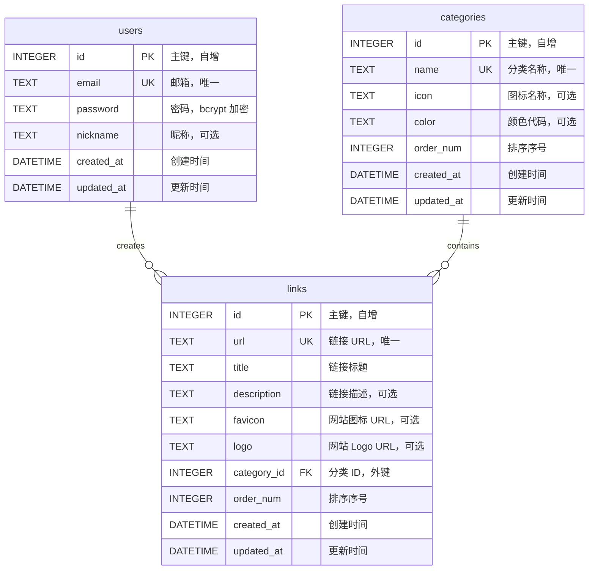

# Cloudflare 导航网站 - 数据库设计文档

## 📋 文档说明

本文档定义 CF-Nav 导航网站的数据库架构，包括表结构设计、索引优化、数据关系、迁移策略和备份方案。

**数据库类型**: Cloudflare D1 (SQLite-compatible)
**ORM**: Drizzle ORM
**版本**: 1.0

---

## 🗄️ 数据库概览

### 技术特点
- **基于 SQLite**: 轻量级、无服务器
- **全局分布**: Cloudflare 边缘数据库
- **ACID 支持**: 事务完整性保证
- **免费套餐限制**:
  - 存储空间: 5 GB
  - 读取: 500 万行/天
  - 写入: 10 万行/天

### 表清单

| 表名 | 用途 | 预估行数 | 关键索引 |
|-----|------|---------|---------|
| `users` | 用户表 | < 10 | `idx_users_email` |
| `categories` | 分类表 | < 20 | `idx_categories_order`, `idx_categories_name` |
| `links` | 链接表 | < 500 | `idx_links_category_id`, `idx_links_order`, `idx_links_url` |

---

## 📊 ER 图 (实体关系图)



---

## 📋 表结构设计

### 1. users 表（用户表）

**用途**: 存储管理员用户信息

**表结构**:
```sql
CREATE TABLE IF NOT EXISTS users (
    id INTEGER PRIMARY KEY AUTOINCREMENT,
    email TEXT UNIQUE NOT NULL,
    password TEXT NOT NULL,
    nickname TEXT,
    created_at DATETIME DEFAULT CURRENT_TIMESTAMP,
    updated_at DATETIME DEFAULT CURRENT_TIMESTAMP
);
```

**字段说明**:

| 字段名 | 类型 | 约束 | 默认值 | 说明 |
|-------|------|------|-------|------|
| `id` | INTEGER | PRIMARY KEY, AUTOINCREMENT | - | 用户 ID，自增主键 |
| `email` | TEXT | UNIQUE, NOT NULL | - | 用户邮箱，唯一标识，用于登录 |
| `password` | TEXT | NOT NULL | - | 密码，bcrypt 加密存储 |
| `nickname` | TEXT | - | NULL | 昵称，可选 |
| `created_at` | DATETIME | - | CURRENT_TIMESTAMP | 创建时间 |
| `updated_at` | DATETIME | - | CURRENT_TIMESTAMP | 更新时间 |

**索引设计**:
```sql
-- 邮箱唯一索引（登录查询优化）
CREATE UNIQUE INDEX IF NOT EXISTS idx_users_email ON users(email);
```

**约束**:
- ✅ 邮箱必须唯一
- ✅ 密码长度 ≥ 8 位（应用层验证）
- ✅ 密码必须包含字母和数字（应用层验证）
- ✅ 邮箱格式验证（应用层验证）

**示例数据**:
```sql
INSERT INTO users (email, password, nickname) VALUES
('admin@example.com', '$2a$10$...', '管理员');
```

**Drizzle ORM Schema**:
```typescript
import { sqliteTable, text, integer } from 'drizzle-orm/sqlite-core'
import { sql } from 'drizzle-orm'

export const users = sqliteTable('users', {
  id: integer('id').primaryKey({ autoIncrement: true }),
  email: text('email').notNull().unique(),
  password: text('password').notNull(),
  nickname: text('nickname'),
  createdAt: text('created_at').default(sql`CURRENT_TIMESTAMP`),
  updatedAt: text('updated_at').default(sql`CURRENT_TIMESTAMP`),
})
```

---

### 2. categories 表（分类表）

**用途**: 存储链接分类信息

**表结构**:
```sql
CREATE TABLE IF NOT EXISTS categories (
    id INTEGER PRIMARY KEY AUTOINCREMENT,
    name TEXT UNIQUE NOT NULL,
    icon TEXT,
    color TEXT,
    order_num INTEGER DEFAULT 0,
    created_at DATETIME DEFAULT CURRENT_TIMESTAMP,
    updated_at DATETIME DEFAULT CURRENT_TIMESTAMP
);

-- 插入默认分类（ID=0 为特殊分类，不可删除）
INSERT INTO categories (id, name, icon, color, order_num) VALUES
(0, '默认分类', 'folder', '#6B7280', 0);
```

**字段说明**:

| 字段名 | 类型 | 约束 | 默认值 | 说明 |
|-------|------|------|-------|------|
| `id` | INTEGER | PRIMARY KEY, AUTOINCREMENT | - | 分类 ID，自增主键 |
| `name` | TEXT | UNIQUE, NOT NULL | - | 分类名称，唯一 |
| `icon` | TEXT | - | NULL | Lucide 图标名称（如 'code', 'book'） |
| `color` | TEXT | - | NULL | 颜色代码（#RRGGBB 格式） |
| `order_num` | INTEGER | - | 0 | 排序序号，用于前端显示顺序 |
| `created_at` | DATETIME | - | CURRENT_TIMESTAMP | 创建时间 |
| `updated_at` | DATETIME | - | CURRENT_TIMESTAMP | 更新时间 |

**索引设计**:
```sql
-- 分类名称唯一索引
CREATE UNIQUE INDEX IF NOT EXISTS idx_categories_name ON categories(name);

-- 排序索引（优化首页分类列表查询）
CREATE INDEX IF NOT EXISTS idx_categories_order ON categories(order_num);
```

**约束**:
- ✅ 分类名称必须唯一
- ✅ ID=0 为默认分类，不可删除（应用层约束）
- ✅ 分类数量 ≤ 20（应用层约束）
- ✅ 颜色代码格式验证（应用层验证）

**示例数据**:
```sql
INSERT INTO categories (name, icon, color, order_num) VALUES
('开发工具', 'code', '#3B82F6', 1),
('设计资源', 'palette', '#10B981', 2),
('学习资料', 'book', '#F59E0B', 3);
```

**Drizzle ORM Schema**:
```typescript
export const categories = sqliteTable('categories', {
  id: integer('id').primaryKey({ autoIncrement: true }),
  name: text('name').notNull().unique(),
  icon: text('icon'),
  color: text('color'),
  orderNum: integer('order_num').default(0),
  createdAt: text('created_at').default(sql`CURRENT_TIMESTAMP`),
  updatedAt: text('updated_at').default(sql`CURRENT_TIMESTAMP`),
})
```

---

### 3. links 表（链接表）

**用途**: 存储导航链接信息

**表结构**:
```sql
CREATE TABLE IF NOT EXISTS links (
    id INTEGER PRIMARY KEY AUTOINCREMENT,
    url TEXT UNIQUE NOT NULL,
    title TEXT NOT NULL,
    description TEXT,
    favicon TEXT,
    logo TEXT,
    category_id INTEGER NOT NULL DEFAULT 0,
    order_num INTEGER DEFAULT 0,
    created_at DATETIME DEFAULT CURRENT_TIMESTAMP,
    updated_at DATETIME DEFAULT CURRENT_TIMESTAMP,
    FOREIGN KEY (category_id) REFERENCES categories(id) ON DELETE SET DEFAULT
);
```

**字段说明**:

| 字段名 | 类型 | 约束 | 默认值 | 说明 |
|-------|------|------|-------|------|
| `id` | INTEGER | PRIMARY KEY, AUTOINCREMENT | - | 链接 ID，自增主键 |
| `url` | TEXT | UNIQUE, NOT NULL | - | 链接 URL，唯一 |
| `title` | TEXT | NOT NULL | - | 链接标题 |
| `description` | TEXT | - | NULL | 链接描述，可选 |
| `favicon` | TEXT | - | NULL | 网站 favicon URL，可选 |
| `logo` | TEXT | - | NULL | 网站 logo URL，可选 |
| `category_id` | INTEGER | FOREIGN KEY, NOT NULL | 0 | 分类 ID，外键关联 categories 表 |
| `order_num` | INTEGER | - | 0 | 排序序号，用于自定义链接顺序 |
| `created_at` | DATETIME | - | CURRENT_TIMESTAMP | 创建时间 |
| `updated_at` | DATETIME | - | CURRENT_TIMESTAMP | 更新时间 |

**索引设计**:
```sql
-- URL 唯一索引（防止重复添加）
CREATE UNIQUE INDEX IF NOT EXISTS idx_links_url ON links(url);

-- 分类 ID 索引（优化按分类查询）
CREATE INDEX IF NOT EXISTS idx_links_category_id ON links(category_id);

-- 排序索引（优化排序查询）
CREATE INDEX IF NOT EXISTS idx_links_order ON links(order_num);

-- 复合索引（优化按分类查询并排序）
CREATE INDEX IF NOT EXISTS idx_links_category_order ON links(category_id, order_num);
```

**外键约束**:
```sql
FOREIGN KEY (category_id) REFERENCES categories(id) ON DELETE SET DEFAULT
```
- **ON DELETE SET DEFAULT**: 删除分类时，将链接的 `category_id` 设置为 0（默认分类）

**约束**:
- ✅ URL 必须唯一
- ✅ URL 格式验证（应用层验证）
- ✅ 标题长度 1-100 位（应用层验证）
- ✅ 描述长度 ≤ 500 位（应用层验证）

**示例数据**:
```sql
INSERT INTO links (url, title, description, favicon, logo, category_id, order_num) VALUES
('https://github.com', 'GitHub', '全球最大的代码托管平台', 'https://github.com/favicon.ico', 'https://github.githubassets.com/images/modules/logos_page/GitHub-Mark.png', 1, 0),
('https://stackoverflow.com', 'Stack Overflow', '程序员问答社区', 'https://stackoverflow.com/favicon.ico', NULL, 1, 1);
```

**Drizzle ORM Schema**:
```typescript
export const links = sqliteTable('links', {
  id: integer('id').primaryKey({ autoIncrement: true }),
  url: text('url').notNull().unique(),
  title: text('title').notNull(),
  description: text('description'),
  favicon: text('favicon'),
  logo: text('logo'),
  categoryId: integer('category_id').notNull().default(0).references(() => categories.id, {
    onDelete: 'set default',
  }),
  orderNum: integer('order_num').default(0),
  createdAt: text('created_at').default(sql`CURRENT_TIMESTAMP`),
  updatedAt: text('updated_at').default(sql`CURRENT_TIMESTAMP`),
})
```

---

## 🔍 索引优化策略

### 索引设计原则
1. **为查询频繁的字段添加索引**（如 `email`, `url`, `category_id`）
2. **为排序字段添加索引**（如 `order_num`）
3. **避免过度索引**（每个索引占用存储空间，影响写入性能）
4. **使用复合索引优化多条件查询**（如 `category_id + order_num`）

### 索引清单

| 表名 | 索引名 | 类型 | 字段 | 用途 |
|-----|-------|------|------|------|
| `users` | `idx_users_email` | UNIQUE | `email` | 登录查询，唯一性约束 |
| `categories` | `idx_categories_name` | UNIQUE | `name` | 分类名称唯一性约束 |
| `categories` | `idx_categories_order` | INDEX | `order_num` | 分类排序查询 |
| `links` | `idx_links_url` | UNIQUE | `url` | URL 唯一性约束 |
| `links` | `idx_links_category_id` | INDEX | `category_id` | 按分类查询 |
| `links` | `idx_links_order` | INDEX | `order_num` | 链接排序查询 |
| `links` | `idx_links_category_order` | INDEX | `category_id, order_num` | 按分类查询并排序 |

### 索引性能分析

**查询示例 1**: 获取某分类下的所有链接并排序
```sql
SELECT * FROM links WHERE category_id = 1 ORDER BY order_num ASC;
```
**使用的索引**: `idx_links_category_order` (复合索引)
**预估性能**: < 10ms（假设 500 条链接）

**查询示例 2**: 用户登录
```sql
SELECT * FROM users WHERE email = 'admin@example.com';
```
**使用的索引**: `idx_users_email` (唯一索引)
**预估性能**: < 5ms

---

## 🔄 数据库迁移策略

### 迁移工具
使用 **Wrangler D1 Migrations** 进行版本化迁移管理。

### 迁移文件结构
```
migrations/
├── 0001_create_users_table.sql
├── 0002_create_categories_table.sql
├── 0003_create_links_table.sql
├── 0004_add_indexes.sql
└── 0005_seed_default_data.sql
```

### 迁移文件示例

#### 0001_create_users_table.sql
```sql
-- Migration: Create users table
-- Created: 2026-01-20

CREATE TABLE IF NOT EXISTS users (
    id INTEGER PRIMARY KEY AUTOINCREMENT,
    email TEXT UNIQUE NOT NULL,
    password TEXT NOT NULL,
    nickname TEXT,
    created_at DATETIME DEFAULT CURRENT_TIMESTAMP,
    updated_at DATETIME DEFAULT CURRENT_TIMESTAMP
);

CREATE UNIQUE INDEX IF NOT EXISTS idx_users_email ON users(email);
```

#### 0002_create_categories_table.sql
```sql
-- Migration: Create categories table
-- Created: 2026-01-20

CREATE TABLE IF NOT EXISTS categories (
    id INTEGER PRIMARY KEY AUTOINCREMENT,
    name TEXT UNIQUE NOT NULL,
    icon TEXT,
    color TEXT,
    order_num INTEGER DEFAULT 0,
    created_at DATETIME DEFAULT CURRENT_TIMESTAMP,
    updated_at DATETIME DEFAULT CURRENT_TIMESTAMP
);

CREATE UNIQUE INDEX IF NOT EXISTS idx_categories_name ON categories(name);
CREATE INDEX IF NOT EXISTS idx_categories_order ON categories(order_num);

-- 插入默认分类
INSERT INTO categories (id, name, icon, color, order_num) VALUES
(0, '默认分类', 'folder', '#6B7280', 0);
```

#### 0003_create_links_table.sql
```sql
-- Migration: Create links table
-- Created: 2026-01-20

CREATE TABLE IF NOT EXISTS links (
    id INTEGER PRIMARY KEY AUTOINCREMENT,
    url TEXT UNIQUE NOT NULL,
    title TEXT NOT NULL,
    description TEXT,
    favicon TEXT,
    logo TEXT,
    category_id INTEGER NOT NULL DEFAULT 0,
    order_num INTEGER DEFAULT 0,
    created_at DATETIME DEFAULT CURRENT_TIMESTAMP,
    updated_at DATETIME DEFAULT CURRENT_TIMESTAMP,
    FOREIGN KEY (category_id) REFERENCES categories(id) ON DELETE SET DEFAULT
);

CREATE UNIQUE INDEX IF NOT EXISTS idx_links_url ON links(url);
CREATE INDEX IF NOT EXISTS idx_links_category_id ON links(category_id);
CREATE INDEX IF NOT EXISTS idx_links_order ON links(order_num);
CREATE INDEX IF NOT EXISTS idx_links_category_order ON links(category_id, order_num);
```

#### 0005_seed_default_data.sql (可选)
```sql
-- Migration: Seed default data
-- Created: 2026-01-20

-- 插入示例分类
INSERT INTO categories (name, icon, color, order_num) VALUES
('开发工具', 'code', '#3B82F6', 1),
('设计资源', 'palette', '#10B981', 2),
('学习资料', 'book', '#F59E0B', 3);

-- 插入示例链接
INSERT INTO links (url, title, description, category_id, order_num) VALUES
('https://github.com', 'GitHub', '全球最大的代码托管平台', 1, 0),
('https://stackoverflow.com', 'Stack Overflow', '程序员问答社区', 1, 1);
```

### 执行迁移

**本地环境**:
```bash
# 应用所有迁移
wrangler d1 migrations apply cf-nav-db --local

# 查看迁移状态
wrangler d1 migrations list cf-nav-db --local
```

**生产环境**:
```bash
# 应用所有迁移
wrangler d1 migrations apply cf-nav-db --remote

# 查看迁移状态
wrangler d1 migrations list cf-nav-db --remote
```

### 回滚策略

**手动回滚**:
```sql
-- 示例：删除 links 表（仅用于开发环境）
DROP TABLE IF EXISTS links;
DROP INDEX IF EXISTS idx_links_url;
DROP INDEX IF EXISTS idx_links_category_id;
DROP INDEX IF EXISTS idx_links_order;
DROP INDEX IF EXISTS idx_links_category_order;
```

**注意**: D1 不支持自动回滚，需要手动编写回滚脚本。

---

## 💾 数据备份策略

### 自动备份
Cloudflare D1 提供自动备份功能：
- **备份频率**: 每日自动备份
- **保留期限**: 30 天
- **恢复方式**: 通过 Cloudflare Dashboard 或 API 恢复

### 手动备份

**导出数据**:
```bash
# 导出整个数据库
wrangler d1 execute cf-nav-db --remote --command "SELECT * FROM sqlite_master" > backup.sql

# 导出单个表
wrangler d1 execute cf-nav-db --remote --command "SELECT * FROM links" --json > links_backup.json
```

**恢复数据**:
```bash
# 从 SQL 文件恢复
wrangler d1 execute cf-nav-db --remote --file=backup.sql
```

### 备份最佳实践
1. **定期备份**: 每周手动备份一次（尤其是大版本更新前）
2. **多地备份**: 将备份文件存储到 GitHub、Google Drive 等
3. **验证备份**: 定期验证备份文件的完整性
4. **版本控制**: 备份文件命名包含日期（如 `backup_2026-01-20.sql`）

---

## 📈 性能优化建议

### 1. 查询优化

**避免 SELECT \***:
```sql
-- ❌ 避免
SELECT * FROM links;

-- ✅ 推荐：仅查询需要的字段
SELECT id, url, title, favicon FROM links;
```

**使用 LIMIT 分页**:
```sql
-- 分页查询（每页 20 条）
SELECT * FROM links LIMIT 20 OFFSET 0;
```

**避免复杂联表查询**:
```sql
-- ❌ 避免：复杂联表
SELECT links.*, categories.name FROM links
JOIN categories ON links.category_id = categories.id;

-- ✅ 推荐：先查分类，再查链接（应用层聚合）
-- 查询 1: SELECT * FROM categories WHERE id = 1;
-- 查询 2: SELECT * FROM links WHERE category_id = 1;
```

### 2. 写入优化

**使用批量插入**:
```sql
-- ❌ 避免：多次单条插入
INSERT INTO links (url, title) VALUES ('url1', 'title1');
INSERT INTO links (url, title) VALUES ('url2', 'title2');

-- ✅ 推荐：批量插入
INSERT INTO links (url, title) VALUES
('url1', 'title1'),
('url2', 'title2'),
('url3', 'title3');
```

**使用事务**:
```typescript
// 批量删除链接（事务保证原子性）
await db.transaction(async (tx) => {
  await tx.delete(links).where(inArray(links.id, [1, 2, 3]))
})
```

### 3. 缓存策略

**缓存热点数据到 Workers KV**:
```typescript
// 缓存链接列表（TTL 5 分钟）
const cacheKey = 'cache:links:all'
const cached = await env.KV.get(cacheKey)
if (cached) {
  return JSON.parse(cached)
}

const links = await db.query.links.findMany()
await env.KV.put(cacheKey, JSON.stringify(links), {
  expirationTtl: 300, // 5 分钟
})
return links
```

---

## 🔐 数据安全

### 1. 敏感数据加密
- ✅ 密码使用 bcrypt 加密（cost factor = 10）
- ✅ JWT Token 签名密钥存储在环境变量
- ✅ 不在数据库存储明文密码

### 2. SQL 注入防护
- ✅ 所有查询使用参数化查询
- ✅ 使用 Drizzle ORM 自动生成安全查询
- ✅ 禁止字符串拼接 SQL

### 3. 数据访问控制
- ✅ 前端公开 API 仅读取数据
- ✅ 写入操作需要 JWT Token 认证
- ✅ 使用 Workers 中间件验证权限

---

## 📊 数据容量规划

### 当前容量估算

| 表名 | 预估行数 | 每行大小 | 总大小 |
|-----|---------|---------|--------|
| `users` | 10 | ~200 bytes | ~2 KB |
| `categories` | 20 | ~150 bytes | ~3 KB |
| `links` | 500 | ~500 bytes | ~250 KB |
| **总计** | **530** | - | **~255 KB** |

### 免费套餐限制检查
- ✅ 存储空间: 255 KB / 5 GB = **0.005%**
- ✅ 读取行数: 假设每天 10,000 次查询，每次 20 行 = 200,000 行/天 / 500 万行 = **4%**
- ✅ 写入行数: 假设每天 100 次写入 = 100 行/天 / 10 万行 = **0.1%**

**结论**: 完全满足免费套餐限制，有大量扩展空间。

### 扩展策略
如果链接数量超过 500 个:
1. **分页加载**: 每页 20-50 条链接
2. **虚拟滚动**: 仅渲染可见区域的链接
3. **归档旧链接**: 将不常用的链接移至归档表
4. **升级套餐**: 考虑 Cloudflare D1 付费套餐（无限存储）

---

## 🧪 数据库测试

### 测试数据生成

```sql
-- 生成测试用户
INSERT INTO users (email, password, nickname) VALUES
('test1@example.com', '$2a$10$...', '测试用户1'),
('test2@example.com', '$2a$10$...', '测试用户2');

-- 生成测试分类
INSERT INTO categories (name, icon, color, order_num) VALUES
('测试分类1', 'code', '#3B82F6', 1),
('测试分类2', 'palette', '#10B981', 2);

-- 生成测试链接（批量插入 100 条）
INSERT INTO links (url, title, description, category_id, order_num)
SELECT
    'https://example.com/' || id,
    '测试链接 ' || id,
    '这是测试链接的描述 ' || id,
    (id % 3),
    id
FROM generate_series(1, 100);
```

### 性能测试

```sql
-- 测试按分类查询性能
EXPLAIN QUERY PLAN
SELECT * FROM links WHERE category_id = 1 ORDER BY order_num;

-- 测试分页查询性能
EXPLAIN QUERY PLAN
SELECT * FROM links LIMIT 20 OFFSET 0;
```

---

## 📝 数据库维护

### 定期维护任务

| 任务 | 频率 | 命令 |
|-----|------|------|
| 数据库备份 | 每周 | `wrangler d1 execute ... > backup.sql` |
| 清理测试数据 | 每月 | `DELETE FROM links WHERE title LIKE '测试%'` |
| 数据完整性检查 | 每月 | `PRAGMA integrity_check` |
| 索引优化分析 | 每季度 | `ANALYZE` |

### VACUUM 操作
```sql
-- 清理删除的数据，回收空间
VACUUM;
```
**注意**: D1 可能不支持 `VACUUM`，具体以官方文档为准。

---

## 📚 参考资料

- [Cloudflare D1 文档](https://developers.cloudflare.com/d1/)
- [SQLite 官方文档](https://www.sqlite.org/docs.html)
- [Drizzle ORM 文档](https://orm.drizzle.team/docs/overview)
- [SQL 索引优化最佳实践](https://use-the-index-luke.com/)

---

## 📝 文档版本

| 版本 | 日期 | 作者 | 变更说明 |
|-----|------|------|---------|
| 1.0 | 2026-01-20 | Claude (系统架构专家) | 初始版本，完整数据库设计 |

---

**文档状态**: ✅ 已完成
**相关文档**:
- [系统架构](./architecture.md)
- [API 规范](./api-spec.md)
- [技术栈决策](./tech-stack.md)

**下一步行动**: 创建技术栈决策文档 (tech-stack.md)
